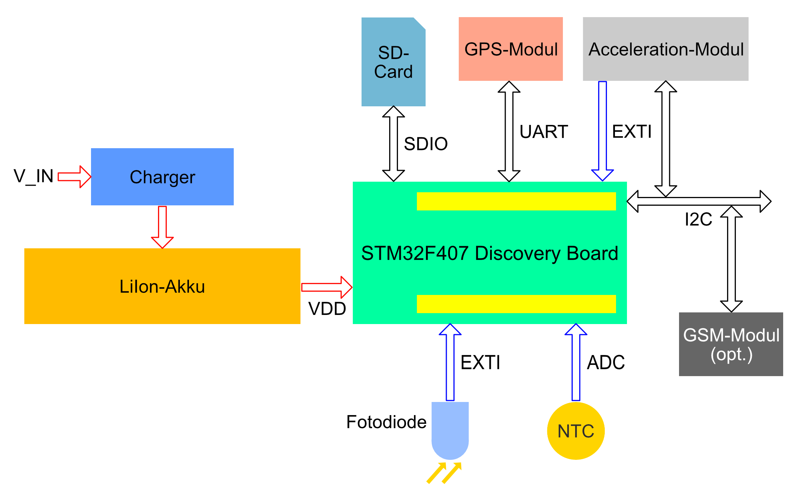

# Transportkontrollsystem

Dieses Repository enthällt die Ergebnisse, die während einer Studienarbeit entstanden sind. 

Es handelt sich um ein Waren-Tracking System, das diverse Umweltparameter erfasst udn euf einer SD-Karte mitschreibt.

